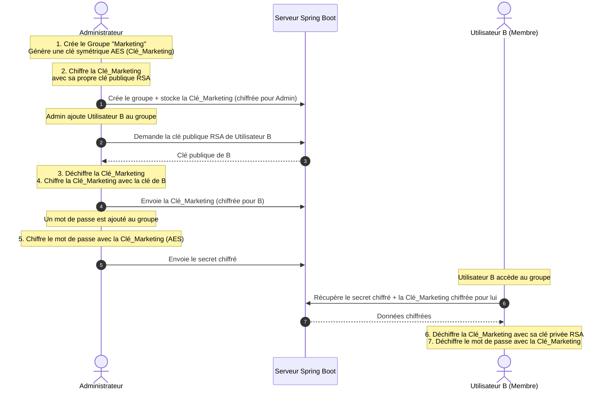

# 🗺️ Roadmap : Système de Partage pour Groupes & Entreprises (Zero-Knowledge)

Pour répondre aux besoins d'une **entreprise** (où plusieurs personnes au sein de groupes/équipes doivent partager un ensemble de mots de passe), le partage de 1 à 1 devient inefficace et lourd à gérer. 

Nous devons mettre en place une architecture de **Partage par Groupes (ou Collections)** basée sur des **Clés de Groupe symétriques**, sécurisée en Zero-Knowledge.

---

## 🔒 Concepts Cryptographiques : Le Partage par Groupe

Dans cette architecture (similaire à celle de Bitwarden ou 1Password), nous introduisons une **Clé de Groupe** (symétrique AES) pour chaque équipe.

### ✅ Avantages de cette approche :
*   **Performance** : Si un groupe contient 500 mots de passe et qu'un nouvel utilisateur arrive, on a juste besoin de chiffrer **une seule fois** la Clé de Groupe pour lui (au lieu de rechiffrer individuellement 500 mots de passe).
*   **Zero-Knowledge complet** : Le serveur ne connaît ni les mots de passe, ni les clés de groupe, ni les clés privées des utilisateurs.

---

## 📅 Roadmap d'Implémentation Adaptée

### Étape 1 : Modèle de Données Backend (Spring Boot)
Il faut modéliser les structures d'organisation, de groupe et d'accès aux clés.
*   [ ] **Entité Groupe / Collection (`Group`)** :
    *   `id` (UUID), `name` (ex: "R&D", "Finance", "Marketing").
*   [ ] **Entité Clé d'Accès au Groupe (`GroupAccess`)** :
    *   Associe un utilisateur à un groupe.
    *   `user_id`, `group_id`.
    *   `encrypted_group_key` : La clé symétrique du groupe, chiffrée avec la clé publique RSA de cet utilisateur spécifique.
    *   `role` : `ADMIN` (peut ajouter des membres), `MEMBER` (lecture/écriture), `VIEWER` (lecture seule).
*   [ ] **Association des Mots de Passe (`Credential`)** :
    *   Ajouter une clé étrangère optionnelle `group_id` sur la table des identifiants (si un mot de passe appartient à un groupe plutôt qu'à un utilisateur individuel).
    *   `encrypted_data` : Chiffré avec la clé symétrique du groupe correspondant.

### Étape 2 : Services Cryptographiques Frontend (React)
*   [ ] **Création de Groupe** :
    *   Générer une clé symétrique forte **AES-GCM 256 bits** (la clé du groupe).
    *   Chiffrer cette clé avec la clé publique RSA du créateur du groupe.
    *   Envoyer le groupe et cette clé d'accès chiffrée au serveur.
*   [ ] **Ajout d'un collaborateur au Groupe** :
    *   L'administrateur du groupe récupère la clé publique du nouveau membre.
    *   Déchiffre localement la clé du groupe (avec sa propre clé privée RSA).
    *   Chiffre la clé du groupe avec la clé publique du nouveau membre.
    *   Envoie cette nouvelle clé d'accès chiffrée au serveur.
*   [ ] **Chiffrement / Déchiffrement des secrets de groupe** :
    *   Lors de l'ajout d'un mdp dans un groupe : Chiffrement local avec la clé du groupe.
    *   Lors de la lecture d'un mdp du groupe : Déchiffrement local avec la clé du groupe (elle-même préalablement déchiffrée par la clé privée de l'utilisateur connecté).

### Étape 3 : Interface Utilisateur & Espace Entreprise (React + Tailwind 4)
*   [ ] **Espace "Groupes" / "Organisation"** :
    *   Une section dédiée dans la barre latérale pour basculer du coffre-fort personnel aux coffres-forts partagés d'entreprise.
*   [ ] **Gestion des membres du groupe** :
    *   Une interface d'administration du groupe permettant d'inviter des collaborateurs par email, de définir leurs rôles (Admin, Éditeur, Lecteur) ou de les révoquer.
*   [ ] **Indicateurs visuels clairs** :
    *   Des icônes distinctes pour identifier en un coup d'œil si un mot de passe est personnel ou s'il appartient à un groupe d'entreprise (avec le nom du groupe visible).
